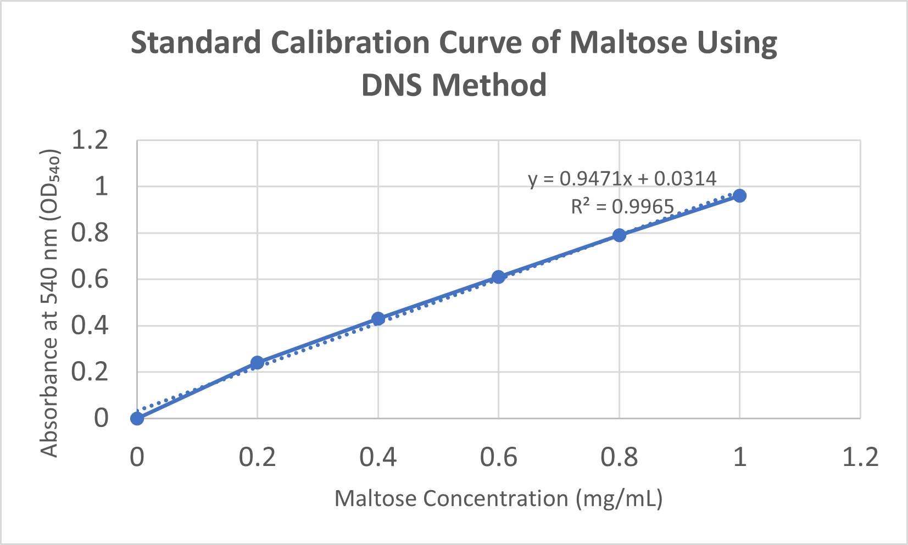
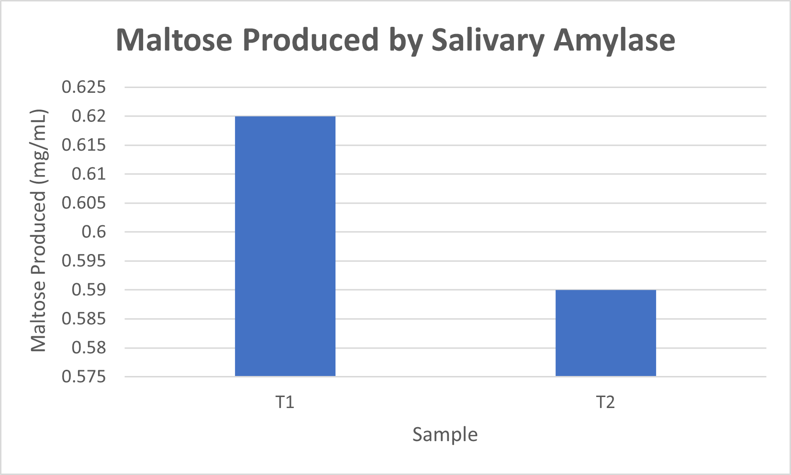

# Salivary Amylase Activity Analysis using DNS Method

## Overview
This project analyzes the activity of salivary amylase by estimating maltose production using the DNS (3,5-dinitrosalicylic acid) method.

A maltose standard curve was constructed and spectrophotometric absorbance values were used to quantify enzyme activity.

## Experiment Workflow
1. Preparation of maltose standards
2. DNS reaction with reducing sugars
3. Measurement of absorbance at 540 nm
4. Construction of maltose calibration curve
5. Analysis of salivary amylase activity
 
## Maltose Standard Curve

## Salivary Amylase Activity

## Data Analysis
- Linear regression analysis of maltose standard curve
- Visualization using scatter plot and bar graph
- Quantitative interpretation of enzyme activity

## Tools Used
- Microsoft Excel
- Spectrophotometric analysis
- Data visualization

## Applications
This workflow demonstrates how experimental laboratory data can be organized, analyzed, and interpreted using quantitative methods.

## Author
Sejal Burli  
BSc Biotechnology
